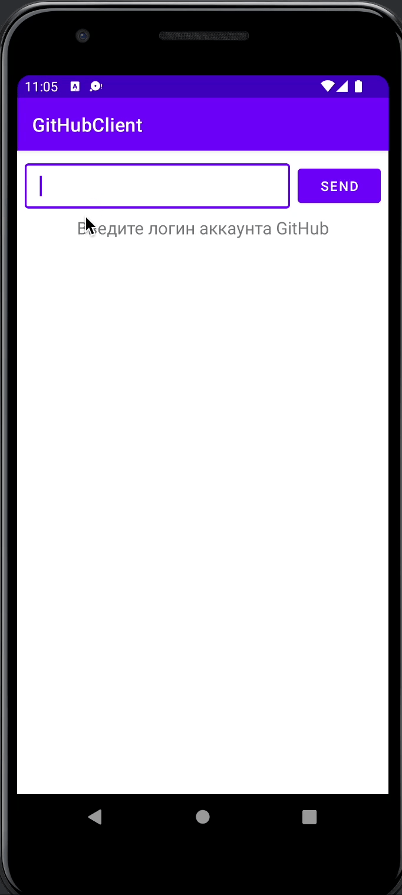

# GitHubClient
Автор - Александр Ящук

Дата создания проекта - 14.04.2022

Приложение для Android создано в учебных целях для отработки практических навыков по теме RxJava, Dagger 2

Рабочая ветка - `master`
 
Задачи:
 
 1) Создать структуру приложения используя паттерн MMVVM с использованием Room, Retrofit, RxJava - сделано ветка - `lesson_1`
 2) Создать экран со списком пользователей - сделано ветка - `lesson_1`
 3) Создать экран с деталями пользователя - сделано ветка - `lesson_1`
 4) Реализовать передачу данных от Repository до ViewModel с помощью RxJava
